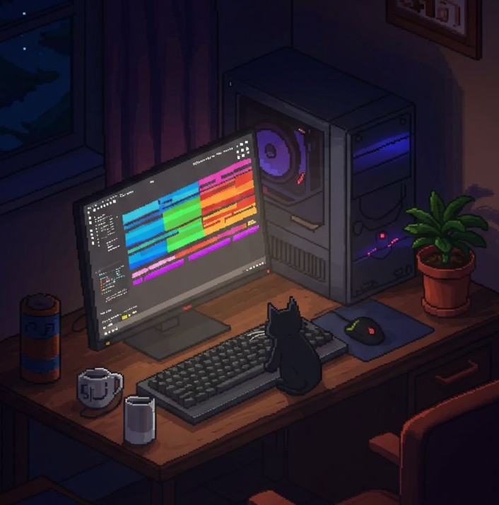
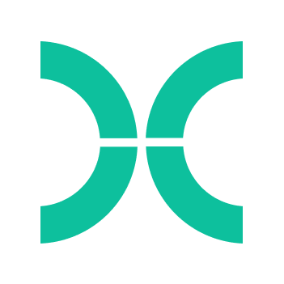

<h1 align="center">Hi 👋, I'm Leonor Elias</h1>
<h3 align="center">🔬 Computational Biologist | 🧬 Data Enthusiast | 🌍 From Portugal</h3>

  

  

---

### :octopus: About Me

- 🔬 Currently working on **Master’s Thesis in Computational Biology and Bioinformatics, at INSA (Lisbon)**
- 🎓 Background in **Biotechonoly**
- 🚀 Interested in **Computational Biology, Bioinformatics, and Data Science**
- 💡 Entrepreneurial experience at **BioCant**
- 📫 Reach me at: **le.rosa@campus.fct.unl.pt**

---

### :globe_with_meridians: Connect With Me

  

---

### :hammer_and_wrench: Languages & Tools 

  
  
  
  
  

